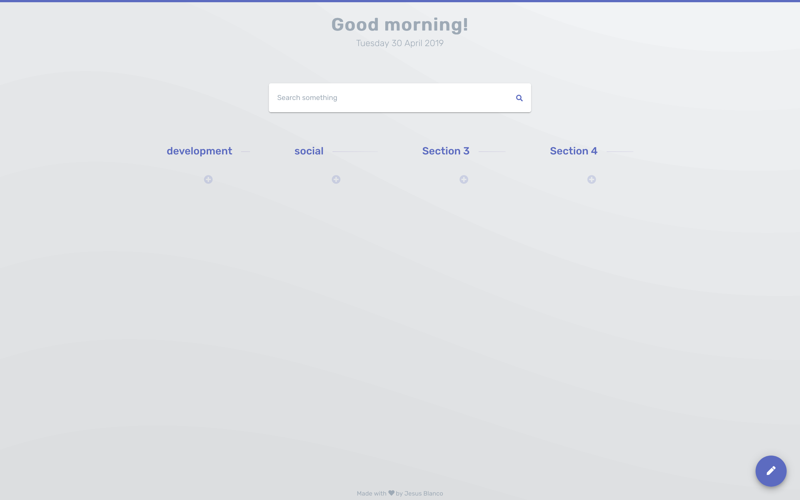

# Material Design Start Page
> Keep your favorites webpages with stylish

### Prerequisites

You only need a browser.

## Built With

* VScode.
* HTML, Vanilla CSS and vanilla JS.
* Coffee.

## Usage example

Add new web pages using plus button on each section, also you can edit the section name using the float button.

## Release History

* 0.1.0
    * Functional release.
* 0.0.7
    * Added Local Storage to sections.
* 0.0.5
    * Added Local Storage to bookmarks.
* 0.0.1
    * Work in progress.

## Meta

Jesus Blanco – [@jesus_blanco96](https://twitter.com/jesus_blanco96)

